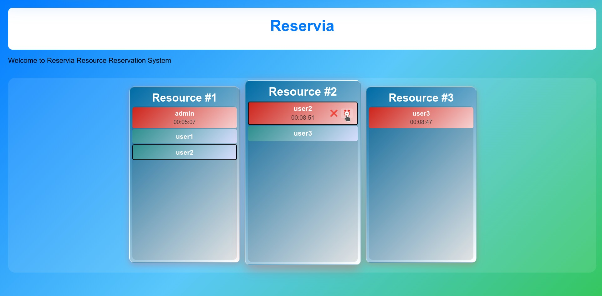
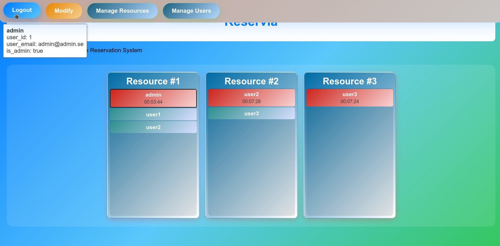

# Reservia - Resource Reservation Management System

> A modern web application for managing shared resource reservations with real-time availability tracking and queue management.

## 🚀 Quick Start

```bash
# Clone and setup
git clone https://github.com/dallaszkorben/reservia.git
cd reservia
python3 -m venv env
source env/bin/activate
pip install -r requirements.txt

# Run the application
python app.py

# Open browser
open http://localhost:5000
```

**Default Login**: Username: `admin`, Password: `admin`

## ✨ Key Features

- 🎯 **Real-time Resource Management** - Live availability tracking
- 🔄 **Automatic Queue System** - Fair resource allocation
- 👥 **Multi-user Support** - Admin and regular user roles
- 🔒 **Secure Authentication** - SHA-256 password hashing
- 📱 **Responsive Design** - Works on desktop and mobile
- ⚡ **Auto-refresh Interface** - Real-time updates without page reload

## 📸 Main Interface

### User Interface with Hover Actions


*User interface showing the hover action system with ❌ (Release/Cancel) and ⏰ (Keep Alive) icons, multi-line countdown display, and real-time reservation management.*

### Admin Interface with Management Menu


*Admin interface displaying the management dropdown menus for user and resource administration, with admin header indicator.*

## 📋 System Requirements

- **Python**: 3.8 or higher
- **Operating System**: Linux, macOS, or Windows
- **Browser**: Modern browser with JavaScript enabled
- **Memory**: 512MB RAM minimum
- **Storage**: 100MB free space

## 📚 Table of Contents

- [🚀 Quick Start](#-quick-start)
- [✨ Key Features](#-key-features)
- [📋 System Requirements](#-system-requirements)
- [🔧 Installation & Setup](#-installation--setup)
- [📚 API Documentation](#-api-documentation)
- [🧪 Testing](#-testing)
- [📁 Project Structure](#-project-structure)
- [🔍 Troubleshooting](#-troubleshooting)

## 🔧 Installation & Setup

### Development Environment

1. **Clone the repository**:
   ```bash
   git clone https://github.com/dallaszkorben/reservia.git
   cd reservia
   ```

2. **Create virtual environment**:
   ```bash
   python3 -m venv env
   source env/bin/activate  # On Windows: env\Scripts\activate
   ```

3. **Install dependencies**:
   ```bash
   pip install -r requirements.txt
   ```

4. **Start the server**:
   ```bash
   python app.py
   ```

5. **Access the application**:
   - **Main Interface**: http://localhost:5000
   - **Health Check**: http://localhost:5000/info/is_alive
   - **API Version**: http://localhost:5000/info/get_version

### Production Deployment

> 🚧 **Coming Soon**: Apache2 configuration guide

## 🎯 How It Works

### For Regular Users
1. **Login** with your credentials
2. **Browse available resources** in the grid view
3. **Click a resource** to request a reservation
4. **Get instant approval** or join the queue
5. **Release resources** when finished

### For Administrators
- **Manage users** - Create, modify, delete accounts
- **Manage resources** - Add/remove bookable items
- **Monitor activity** - View all reservations and queues
- **Visual indicator** - Red header shows admin status

## 🔑 Technology Stack

| Component | Technology |
|-----------|------------|
| **Backend** | Python Flask |
| **Database** | SQLite + SQLAlchemy ORM |
| **Frontend** | HTML5, CSS3, JavaScript (jQuery) |
| **Security** | SHA-256 password hashing |
| **Testing** | Python unittest framework |

## ⚙️ Configuration

### Backend Configuration

The system uses centralized configuration in `backend/config/config.py`:

```python
CONFIG = {
    'approved_keep_alive_sec': 600,     # Default 10 minutes (600 seconds)
    'requested_keep_alive_sec': 1800,   # Default 30 minutes (1800 seconds), 0 = disabled
    'expiration_check_interval_sec': 1  # Check for expired reservations every 1 second
}
```

### Key Settings

- **`approved_keep_alive_sec`**: Duration (in seconds) that approved reservations remain valid before automatic expiration
- **`requested_keep_alive_sec`**: Duration (in seconds) that requested reservations remain valid. Set to `0` or `None` to disable expiration for requested reservations
- **`expiration_check_interval_sec`**: Frequency (in seconds) for background thread to check for expired reservations

### Frontend Configuration

Frontend settings are available in `frontend/static/js/config.js` for client-side access to configuration values.

## Project Structure
```
reservia/
├── backend/
│   ├── app/
│   │   ├── views/           # Flask blueprints and endpoints
│   │   │   ├── base_view.py     # Base view class for inheritance
│   │   │   ├── home_bp.py       # Home blueprint manager
│   │   │   └── info_bp.py       # Info blueprint manager
│   │   ├── models/          # SQLAlchemy database models
│   │   ├── application.py   # Main ReserviaApp class
│   │   ├── constants.py     # Global constants (log prefixes)
│   │   ├── database.py      # Database singleton class
│   │   └── __init__.py      # Package initialization
│   └── config/          # Backend configuration files
├── frontend/
│   ├── templates/       # HTML templates
│   └── static/          # CSS, JavaScript, images
├── tests/                   # Legacy test directory
├── backend/tests/           # Backend test suite (organized by functional area)
│   ├── test_user_management.py     # User operations (database + API)
│   ├── test_resource_management.py # Resource operations (database + API)
│   ├── test_session_management.py  # Authentication and sessions (database + API)
│   ├── test_reservation_system.py  # Reservation lifecycle (database + API)
│   └── run_all_tests.py            # Master test runner with reporting
├── frontend/tests/          # Frontend test directory (manual testing)
├── docs/                    # Documentation and assets
│   ├── images/              # Screenshots, diagrams, visual assets
│   │   └── main_user_screen.jpg # Main interface screenshot
│   └── wiki/                # Additional documentation pages
├── amazonq-context/     # Amazon Q session context files
│   ├── backend_context.md   # Backend architecture and setup
│   └── frontend_context.md  # Frontend architecture and components
├── app.py              # Main Flask application entry point
├── requirements.txt    # Python dependencies
└── README.md           # This file
```

## Running the Server

### Temporary Development Server (Flask built-in)

1. Create and activate virtual environment:
```bash
python3 -m venv env
source env/bin/activate
```

2. Install dependencies:
```bash
pip install -r requirements.txt
```

3. Run the development server:
```bash
python app.py
```

4. Access the application:
- Main page: http://localhost:5000
- Health check: http://localhost:5000/info/is_alive
- Version info: http://localhost:5000/info/get_version

### Permanent Production Server (Apache2)
(To be configured in future development phases)

## Setup Instructions
(To be added in future development phases)

## Database Schema

### Users Table
- `id` (INTEGER, Primary Key, Auto-increment)
- `email` (TEXT, Unique, NOT NULL)
- `name` (TEXT, NOT NULL)
- `is_admin` (BOOLEAN, Default: False, NOT NULL)

### Resources Table
- `id` (INTEGER, Primary Key, Auto-increment)
- `name` (TEXT, Unique, NOT NULL)
- `comment` (TEXT, NULL)

### Passwords Table
- `id` (INTEGER, Primary Key, Auto-increment)
- `user_id` (INTEGER, Foreign Key → Users.id)
- `password_hash` (TEXT, NOT NULL) - SHA-256 hashed password

### ReservationLifecycle Table
- `id` (INTEGER, Primary Key, Auto-increment)
- `user_id` (INTEGER, Foreign Key → Users.id)
- `resource_id` (INTEGER, Foreign Key → Resources.id)
- `request_date` (INTEGER, NOT NULL) - Unix timestamp
- `approved_date` (INTEGER, NULL) - Unix timestamp
- `cancelled_date` (INTEGER, NULL) - Unix timestamp
- `released_date` (INTEGER, NULL) - Unix timestamp
- `valid_until_date` (INTEGER, NOT NULL) - Unix timestamp for reservation expiration

## ⏰ Reservation Expiration System

### Dual Expiration Model
The system supports configurable expiration for both approved and requested reservations:

#### **Approved Reservations** (Always Active)
- **Automatic expiration** after `approved_keep_alive_sec` (default: 10 minutes)
- **Keep-alive functionality** available via UI hover actions or API
- **Auto-approval** of next queued user when reservation expires
- **Real-time countdown** displayed in GUI

#### **Requested Reservations** (Configurable)
**Option 1: With Expiration** (`requested_keep_alive_sec > 0`)
- **Automatic expiration** after `requested_keep_alive_sec` (default: 30 minutes)
- **Keep-alive functionality** available for requested reservations
- **Real-time countdown** displayed in GUI
- **Auto-cancellation** when expiration time reached

**Option 2: No Expiration** (`requested_keep_alive_sec = 0` or `None`)
- **No automatic expiration** for requested reservations
- **No countdown display** in GUI (single-line user items)
- **No keep-alive functionality** for requested reservations
- **Manual cancellation only**

### Configuration
```python
CONFIG = {
    'approved_keep_alive_sec': 600,    # 10 minutes for approved reservations
    'requested_keep_alive_sec': 1800,  # 30 minutes for requested reservations (0 = disabled)
    'expiration_check_interval_sec': 1  # Background check frequency
}
```

### Database Schema
- **`valid_until_date`**: `NULL` when no expiration, timestamp when expiration enabled
- **Automatic migration** handles schema updates for existing databases
- **Thread-safe operations** ensure data consistency

### Architecture Benefits
- **Flexible configuration**: Enable/disable expiration per reservation type
- **Application-level management**: Expiration thread managed by ReserviaApp class
- **Clean separation**: Database class focuses on data operations only
- **Proper shutdown**: Thread cleanup on application termination
- **Scalable design**: Easy to modify timeout values and check intervals

## Current Features

### API Endpoints
- **GET /** - Main application page
- **GET /info/is_alive** - Health check endpoint
- **GET /info/get_version** - Application version information
- **POST /session/login** - User login (requires JSON payload)
- **POST /session/logout** - User logout
- **GET /session/status** - Check current session status
- **POST /admin/user/add** - Add new user (requires admin login and JSON payload)
- **POST /admin/user/modify** - Modify user data (admin can modify any user, user can modify self)
- **GET /info/users** - Get all users (requires admin login)
- **POST /admin/resource/add** - Add new resource (requires admin login and JSON payload)
- **POST /admin/resource/modify** - Modify resource data (requires admin login and JSON payload)
- **GET /info/resources** - Get all resources
- **POST /reservation/request** - Request resource reservation (requires user login)
- **GET /reservation/active** - Get all active reservations (requires user login)
- **POST /reservation/cancel** - Cancel user's reservation (requires user login)
- **POST /reservation/release** - Release approved reservation (requires user login)
- **POST /reservation/keep_alive** - Extend approved reservation validity (requires user login)

### Database Management
- SQLite database with SQLAlchemy ORM
- Automatic table creation on first run
- User management (create/retrieve users)
- Resource management (create/retrieve resources)
- Reservation lifecycle management with queue system
- SQL injection protection through ORM
- Structured error handling with specific error codes

### Logging System
- Rotating log files in user home directory (~/.reservia/)
- Configurable log levels and backup count
- Structured logging with component prefixes
- Both file and console output

### Backend Architecture
- Object-oriented design with class-based views
- Singleton database pattern
- Blueprint-based modular endpoint organization
- Configuration-driven application setup
- Reservation queue system with auto-approval logic
- Thread-safe database operations with locking
- Google Style documentation standards
- Automatic reservation expiration with background monitoring
- Configurable keep-alive system for approved reservations

### Frontend Architecture
- **LayoutManager**: Static utility class for responsive grid positioning calculations
- **ResourcePool**: Singleton managing resource collection and layout updates
- **Resource**: Pure data model with user management and configurable font sizes
- **ResourceView**: DOM rendering and event handling with proper separation of concerns
- Clean separation between data models and view components
- Independent Resource class with static configuration
- Dependency injection for view components
- **Conditional countdown timers**: Display based on `valid_until_date` presence
- **Dual-timer system**: 5-second server sync + 1-second UI updates
- **Hover action interface**: Keep-alive and cancel/release actions for user's own reservations
- **Multi-line layout**: Separate lines for user name and countdown timer when applicable

## Testing

### Backend Tests

The backend test suite is organized into logical functional areas for better maintainability and clarity:

#### Test Organization

- **`test_user_management.py`** - User operations (create, modify, retrieve, authorization)
- **`test_resource_management.py`** - Resource operations (create, modify, retrieve, authorization)
- **`test_session_management.py`** - Authentication and session management
- **`test_reservation_system.py`** - Reservation lifecycle and queue management
- **`run_all_tests.py`** - Master test runner with comprehensive reporting

#### Running Tests

To run backend tests, execute from the project root directory:

1. **Activate virtual environment**:
   ```bash
   source env/bin/activate
   ```

2. **Run all tests** (recommended):
   ```bash
   python3 -m backend.tests.run_all_tests
   ```

3. **Run specific functional area**:
   ```bash
   # User management tests (database + API)
   python3 -m backend.tests.test_user_management
   
   # Resource management tests (database + API)
   python3 -m backend.tests.test_resource_management
   
   # Session management tests (database + API)
   python3 -m backend.tests.test_session_management
   
   # Reservation system tests (database + API)
   python3 -m backend.tests.test_reservation_system
   ```

**Note**: All backend tests must be run from the project root (`reservia/`) directory to properly resolve module imports.

### Frontend Tests

Frontend testing is done through browser-based interactive testing:

1. **Activate virtual environment and start the development server**:
   ```bash
   source env/bin/activate
   python app.py
   ```

2. **Modify `frontend/templates/index.html` for testing** (if needed):

   The HTML already includes test initialization. To change test behavior, modify the JavaScript in the `$(document).ready()` function:

   ```javascript
   // Current default test (interactive user simulation)
   testSimulateUserOperations();

   // Alternative: Visual layout test with sample data
   // testLookOfTheResourceElements();
   ```

   **Available test functions**:
   - `testSimulateUserOperations()` - Interactive testing with user input field
   - `testLookOfTheResourceElements()` - Populates 15 resources with sample data for layout testing

3. **Open browser and navigate to**: http://localhost:5000

3. **Interactive Test Features** (automatically loaded):
   - **User Simulation**: Use the "User" input field to simulate different users
   - **Resource Operations**: Click resources to add reservations, click users to cancel/release
   - **Console Logging**: Check browser console for operation logs (ADDED, CANCELLED, RELEASED)
   - **Real-time Updates**: Test responsive layout and user list updates

4. **Manual Test Components**:
   - Resource grid layout and responsiveness
   - User list scrolling and font size configuration
   - Window resize behavior and layout recalculation
   - Apple-styled UI components and interactions
   - Login/logout functionality

5. **Browser Developer Tools Testing**:
   - Open browser DevTools (F12)
   - Monitor JavaScript console for errors and test logs
   - Verify responsive layout at different screen sizes
   - Check network requests for API calls
   - Test session management and authentication

**Frontend Test Files**:
- `frontend/static/js/test_frontend.js` - Interactive test functions
- `frontend/templates/index.html` - Includes test initialization
- Test functions: `testSimulateUserOperations()`, `testLookOfTheResourceElements()`

### Test Architecture

The backend test suite follows a **functional area organization** for better maintainability:

#### Functional Areas

| Test File | Coverage | Database Tests | API Tests |
|-----------|----------|----------------|----------|
| **User Management** | User CRUD operations, authorization | `create_user()`, `modify_user()`, `get_users()` | `/admin/user/add`, `/admin/user/modify`, `/info/users` |
| **Resource Management** | Resource CRUD operations, authorization | `create_resource()`, `modify_resource()`, `get_resources()` | `/admin/resource/add`, `/admin/resource/modify`, `/info/resources` |
| **Session Management** | Authentication, login/logout, session state | `login()`, `logout()`, `is_logged_in()` | `/session/login`, `/session/logout`, `/session/status` |
| **Reservation System** | Reservation lifecycle, queue management | `request_reservation()`, `cancel_reservation()`, `release_reservation()` | `/reservation/request`, `/reservation/cancel`, `/reservation/release` |

#### Test Features

- **Isolated Testing** - Each test file uses separate test databases
- **Comprehensive Coverage** - Both database layer and API endpoints tested
- **Proper Cleanup** - Database cleanup and singleton reset in each test
- **Error Handling** - Proper error reporting and test isolation
- **Master Runner** - Single command execution with detailed reporting
- **Logical Flow** - Tests run in dependency order: Session → Users → Resources → Reservations

## 📚 API Documentation

### 🔒 Authentication

**Important**: All passwords must be SHA-256 hashed before sending to the API.

#### Password Hashing Examples

#### Using Python
```python
import hashlib

def hash_password(password):
    return hashlib.sha256(password.encode()).hexdigest()

# Example usage
plain_password = "admin"
hashed_password = hash_password(plain_password)
print(f"Hashed password: {hashed_password}")
# Output: 8c6976e5b5410415bde908bd4dee15dfb167a9c873fc4bb8a81f6f2ab448a918
```

#### Using Node.js
```javascript
const crypto = require('crypto');

function hashPassword(password) {
    return crypto.createHash('sha256').update(password).digest('hex');
}

// Example usage
const plainPassword = "admin";
const hashedPassword = hashPassword(plainPassword);
console.log(`Hashed password: ${hashedPassword}`);
// Output: 8c6976e5b5410415bde908bd4dee15dfb167a9c873fc4bb8a81f6f2ab448a918
```

#### Using Command Line (Linux/macOS)
```bash
# Hash a password using echo and sha256sum
echo -n "admin" | sha256sum | cut -d' ' -f1
# Output: 8c6976e5b5410415bde908bd4dee15dfb167a9c873fc4bb8a81f6f2ab448a918

# Or using openssl
echo -n "admin" | openssl dgst -sha256 | cut -d' ' -f2
# Output: 8c6976e5b5410415bde908bd4dee15dfb167a9c873fc4bb8a81f6f2ab448a918
```

### Usage of Endpoints

Once the server is running, you can test the endpoints using curl from the console:

#### Home Page
```bash
curl http://localhost:5000/
```

#### Health Check
```bash
curl http://localhost:5000/info/is_alive
```
Expected response:
```json
{"status": "alive", "service": "Reservia"}
```

#### Version Information
```bash
curl http://localhost:5000/info/get_version
```
Expected response:
```json
{"version": "1.0.0"}
```

#### User Login (Save Session Cookie)
```bash
# Hash the password first
HASHED_PASSWORD=$(echo -n "admin" | sha256sum | cut -d' ' -f1)

# Use the hashed password in the curl request
curl -H "Content-Type: application/json" -X POST -c cookies.txt -d "{\"name\": \"admin\", \"password\": \"$HASHED_PASSWORD\"}" http://localhost:5000/session/login
```
Expected response:
```json
{"message": "Login successful", "user_name": "admin"}
```
**Note**: The `-c cookies.txt` saves the session cookie to a file for subsequent requests.

#### User Logout (Use Session Cookie)
```bash
curl -X POST -b cookies.txt http://localhost:5000/session/logout
```
Expected response:
```json
{"message": "Logout successful"}
```

#### Add User (Admin Only - Requires Session Cookie)
```bash
# Hash the password first
HASHED_PASSWORD=$(echo -n "secret123" | sha256sum | cut -d' ' -f1)

# Use the hashed password in the curl request
curl -H "Content-Type: application/json" -X POST -b cookies.txt -d "{\"name\": \"John Doe\", \"email\": \"john@example.com\", \"password\": \"$HASHED_PASSWORD\"}" http://localhost:5000/admin/user/add
```
Expected response:
```json
{"message": "User created successfully", "user_id": 2}
```

#### Modify User Data (Admin can modify any user, User can modify self - Requires Session Cookie)
```bash
# Hash the password first
HASHED_PASSWORD=$(echo -n "newpass123" | sha256sum | cut -d' ' -f1)

# Use the hashed password in the curl request
curl -H "Content-Type: application/json" -X POST -b cookies.txt -d "{\"user_id\": 2, \"email\": \"newemail@example.com\", \"password\": \"$HASHED_PASSWORD\"}" http://localhost:5000/admin/user/modify
```
Expected response:
```json
{"message": "User modified successfully", "user_id": 2}
```

#### Add Resource (Admin Only - Requires Session Cookie)
```bash
curl -H "Content-Type: application/json" -X POST -b cookies.txt -d '{"name": "Meeting Room", "comment": "Conference room for 10 people"}' http://localhost:5000/admin/resource/add
```
Expected response:
```json
{"message": "Resource created successfully", "resource_id": 1}
```

#### Modify Resource (Admin Only - Requires Session Cookie)
```bash
curl -H "Content-Type: application/json" -X POST -b cookies.txt -d '{"resource_id": 1, "name": "Updated Meeting Room", "comment": "Updated conference room for 12 people"}' http://localhost:5000/admin/resource/modify
```
Expected response:
```json
{"message": "Resource modified successfully", "resource_id": 1}
```

#### Get All Users (Admin Only - Requires Session Cookie)
```bash
curl -H "Content-Type: application/json" -X GET -b cookies.txt http://localhost:5000/info/users
```
Expected response:
```json
{"message": "Users retrieved successfully", "users": [{"id": 1, "name": "admin", "email": "admin@example.com", "is_admin": true}], "count": 1}
```

#### Get All Resources
```bash
curl -H "Content-Type: application/json" -X GET http://localhost:5000/info/resources
```
Expected response:
```json
{"message": "Resources retrieved successfully", "resources": [{"id": 1, "name": "Meeting Room", "comment": "Conference room for 10 people"}], "count": 1}
```

#### Request Reservation (User Login Required)
```bash
curl -H "Content-Type: application/json" -X POST -b cookies.txt -d '{"resource_id": 1}' http://localhost:5000/reservation/request
```
Expected response:
```json
{"message": "Reservation request successful", "reservation_id": 1, "resource_id": 1, "status": "approved"}
```

#### Get Active Reservations (User Login Required)
```bash
curl -H "Content-Type: application/json" -X GET -b cookies.txt "http://localhost:5000/reservation/active?resource_id=1"
```
Expected response:
```json
{"message": "Active reservations retrieved successfully", "reservations": [...], "count": 2}
```

#### Cancel Reservation (User Login Required)
```bash
curl -H "Content-Type: application/json" -X POST -b cookies.txt -d '{"resource_id": 1}' http://localhost:5000/reservation/cancel
```
Expected response:
```json
{"message": "Reservation cancelled successfully", "reservation_id": 1, "resource_id": 1, "cancelled_date": "2023-12-21T10:45:30+01:00"}
```

#### Release Reservation (User Login Required)
```bash
curl -H "Content-Type: application/json" -X POST -b cookies.txt -d '{"resource_id": 1}' http://localhost:5000/reservation/release
```
Expected response:
```json
{"message": "Reservation released successfully", "reservation_id": 1, "resource_id": 1, "released_date": "2023-12-21T11:00:15+01:00"}
```

#### Keep Alive Reservation (User Login Required)
```bash
curl -H "Content-Type: application/json" -X POST -b cookies.txt -d '{"resource_id": 1}' http://localhost:5000/reservation/keep_alive
```
Expected response:
```json
{"message": "Reservation kept alive successfully", "reservation_id": 1, "resource_id": 1, "valid_until_date": "2023-12-21T11:10:15+01:00"}
```

#### Check Session Status (Use Session Cookie)
```bash
curl -b cookies.txt http://localhost:5000/session/status
```
Expected response (logged in):
```json
{"logged_in": true, "user_id": 1, "user_email": "admin@example.com", "user_name": "admin", "is_admin": true}
```
Expected response (logged out):
```json
{"logged_in": false}
```

### Session Management Workflow
1. **Login**: Use `-c cookies.txt` to save session cookie
2. **Authenticated requests**: Use `-b cookies.txt` to send session cookie
3. **Logout**: Use `-b cookies.txt -c cookies.txt` to properly clear session cookie

**Note**: The logout endpoint properly invalidates the session cookie. After logout, subsequent requests to admin endpoints will fail with authentication errors.

## Reservation System Features

### Queue Management
- Multiple users can request the same resource
- First user gets auto-approved if resource is available
- Subsequent users are queued (request_date set, approved_date null)
- When approved user releases resource, next queued user is auto-approved
- Automatic expiration of approved reservations after configurable timeout
- Keep-alive functionality to extend reservation validity

### Resource Status Logic
- **Available**: No active reservations or last reservation has released_date
- **Occupied**: Last non-cancelled reservation has no released_date
- **Queued**: Multiple users waiting for resource availability

### Error Handling
- Structured database responses with specific error codes
- Proper HTTP status codes (401, 403, 404, 409)
- Comprehensive logging with user and resource details

### Frontend Features
- **Responsive Resource Grid**: Automatic layout calculation based on screen width
- **Scrollable User Lists**: Apple-styled blue scrollbars with overflow handling
- **Interactive Resource Management**: Click handling for resources and hover actions for user operations
- **Customizable Font Sizes**: Per-resource user list font size configuration
- **Real-time Layout Updates**: Window resize support with automatic repositioning
- **Event System**: Separate event handlers for resource selection and user actions
- **Live Countdown Display**: Real-time remaining time in HH:MM:SS format on separate line
- **Hover Action Interface**: Icon-based actions (❌ Release/Cancel, ⏰ Keep Alive) for logged-in user's reservations
- **Multi-line User Items**: User name and countdown timer displayed on separate lines for better readability

### User Interface Components
- **Resource Rectangles**: Configurable size containers with titles and user lists (default 250x400px)
- **User List Items**: Scrollable containers with customizable font sizes and dynamic heights (25px standard, 40px with countdown)
- **Hover Action Buttons**: Transparent background icons that appear on hover for logged-in user's reservations
- **Apple Design System**: Blue gradient themes and glass effects
- **Responsive Layout**: Centered grid with proper spacing and gaps

### Event Handling
- **Resource Click**: Triggers `ResourcePool.onResourceSelected(resource_id)` for reservation requests
- **Hover Actions**: Icon-based actions trigger `user_action` events with specific action types
- **Action Types**: `release` (❌), `cancel` (❌), `keep_alive` (⏰)
- **User Restrictions**: Only logged-in user can see and use action buttons on their own reservations
- **Proper Event Separation**: No conflicts between resource clicks and hover action buttons

## 🧪 Testing

### Quick Test
```bash
# Run all backend tests with comprehensive reporting
source env/bin/activate
python3 -m backend.tests.run_all_tests
```

### Frontend Testing
1. Start the server: `python app.py`
2. Open http://localhost:5000
3. Use browser DevTools (F12) to monitor console
4. Test login/logout and resource operations

## 🔍 Troubleshooting

### Common Issues

**❌ Server won't start**
```bash
# Check if port 5000 is in use
lsof -i :5000
# Kill process if needed
kill -9 <PID>
```

**❌ Login fails**
- Ensure password is SHA-256 hashed
- Check browser console for errors
- Verify cookies are enabled

**❌ Tests fail**
- Run from project root directory: `cd reservia/`
- Ensure virtual environment is activated
- Check Python version: `python3 --version`

### Getting Help

1. Check the [Issues](link-to-issues) page
2. Review the logs in `~/.reservia/`
3. Enable debug mode: Set `DEBUG=True` in config

## 📁 Project Structure

<details>
<summary>Click to expand detailed structure</summary>

```
reservia/
├── backend/              # Server-side code
│   ├── app/
│   │   ├── views/       # API endpoints
│   │   ├── database.py  # Data layer
│   │   └── application.py # Main app
│   └── tests/           # Backend tests
├── frontend/             # Client-side code
│   ├── static/          # CSS, JS, images
│   └── templates/       # HTML templates
├── docs/                 # Documentation and assets
│   ├── images/          # Screenshots and diagrams
│   └── wiki/            # Additional documentation
├── app.py               # Application entry point
├── requirements.txt     # Python dependencies
└── README.md           # This documentation
```

</details>

## 🚀 What's Next

- [ ] Apache2 production deployment guide
- [ ] User dashboard with reservation history
- [ ] Email notifications for queue updates
- [ ] Resource categories and filtering
- [ ] Mobile app development

---

**Made with ❤️ using Python Flask** | [Report Issues](link-to-issues) | [Contribute](link-to-contributing)